## Intro 
- 진도 : 03_Color_Transform.pdf
- Camera Geomety - 내용을 이어서 한다.
- Lens Distortion 내용을 다룬다.
- Color Transform 사용

## 1. Lens Distortion Model
### 1). Brown Model
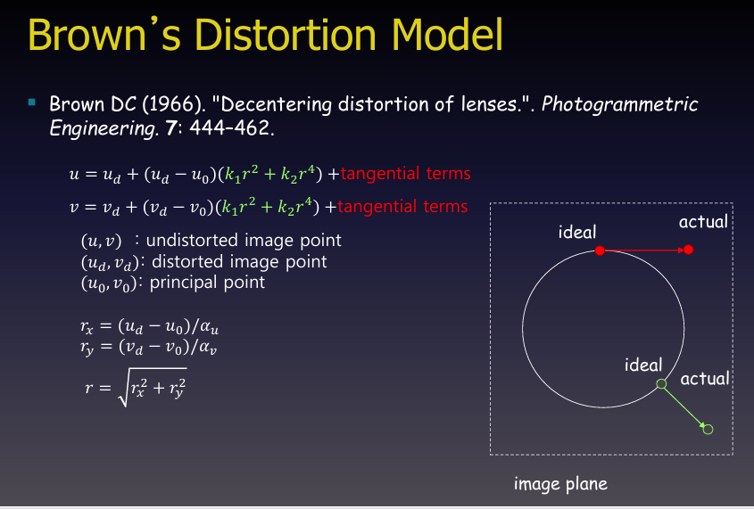

**기본 개념 및 수식 정의**

* **$(u, v)$**: 왜곡이 없는 이상적인(undistorted) 이미지 상의 픽셀 좌표
* **$(u_d, v_d)$**: 렌즈 왜곡이 포함된 실제(distorted) 이미지 상의 픽셀 좌표
* **$(u_0, v_0)$**: 광축이 센서와 만나는 주점(Principal point)의 좌표
* **$r$**: 주점에서 왜곡된 점까지의 거리(Radial distance)로, 이미지 센서의 스케일 팩터($\alpha_u, \alpha_v$)를 고려하여 정규화된 좌표계($r_x, r_y$)를 바탕으로 $r = \sqrt{r_x^2 + r_y^2}$로 계산됩니다.

**왜곡 모델의 구성**

* **방사 왜곡 (Radial Distortion)**: 수식에서 $(u_d - u_0)(k_1r^2 + k_2r^4)$ 등에 해당하는 부분으로, 렌즈의 곡면 때문에 빛이 중심에서 멀어질수록 휘어지는 현상(배럴 왜곡 또는 핀쿠션 왜곡)을 보정합니다. $k_1, k_2$는 방사 왜곡 계수입니다.
* **접선 왜곡 (Tangential Distortion)**: 수식의 `+tangential terms`에 해당하는 부분으로, 렌즈와 이미지 센서가 완벽하게 평행을 이루지 못하고 기울어지거나 정렬이 틀어졌을 때 발생합니다.

**우측 다이어그램의 의미**

* **ideal (이상적 위치)**: 왜곡이 없다면 맺혀야 할 정밀한 위치입니다.
* **actual (실제 위치)**: 렌즈의 광학적 결함으로 인해 빛이 꺾여 실제로 센서에 맺히는 위치입니다.
* 브라운의 모델은 이러한 `actual` 좌표로부터 원래의 `ideal` 좌표를 역산하거나 보정하여 반듯한 이미지를 얻는 데 활용됩니다.

### 2). Fitzgibbon Model
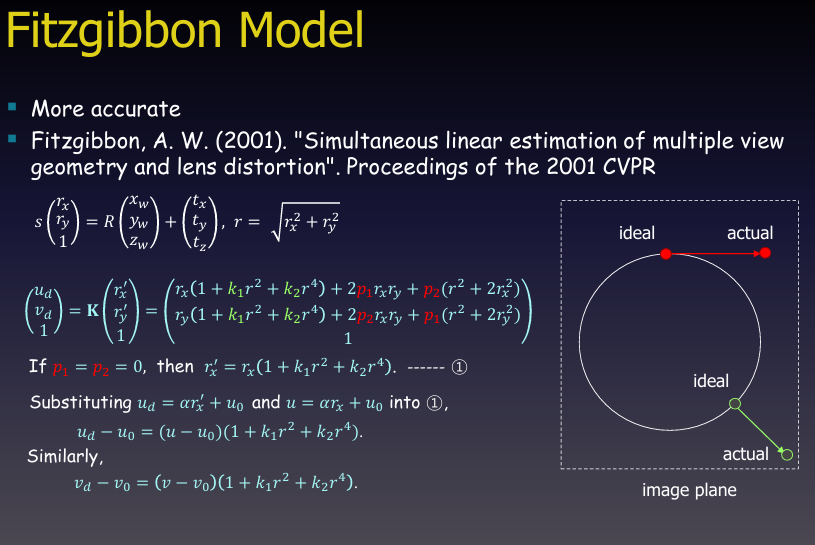

- 컴퓨터 비전 및 포토그래메트리 분야에서 렌즈 왜곡과 카메라 외부 파라미터를 더욱 정확하게 추정하기 위해 앤드루 피츠기본(Andrew W. Fitzgibbon)이 2001년에 제안한 피츠기본 모델(Fitzgibbon Model)을 설명하고 있습니다. 
- "이전 브라운(Brown) 모델의 개념을 확장"하여, 3차원 공간 좌표에서 이미지 평면으로의 투영과 왜곡 과정을 하나의 일관된 행렬 연산 체계로 다루는 것이 특징입니다.

**주요 수식 및 구성 요소**

* **3차원 좌표의 투영 변환**:

$$s \begin{pmatrix} r_x \\ r_y \\ 1 \end{pmatrix} = R \begin{pmatrix} x_w \\ y_w \\ z_w \end{pmatrix} + \begin{pmatrix} t_x \\ t_y \\ t_z \end{pmatrix}, \quad r = \sqrt{r_x^2 + r_y^2}$$

3차원 월드 좌표 $(x_w, y_w, z_w)$가 회전 행렬($R$)과 평행이동 벡터($t$)를 통해 카메라 좌표계로 변환되고, 스케일 팩터 $s$와 정규화된 이미지 좌표 $(r_x, r_y)$로 표현되는 과정입니다. $r$은 주점으로부터의 반경 거리입니다.

* **왜곡이 반영된 최종 픽셀 좌표 ($u_d, v_d$)**:

$$\begin{pmatrix} u_d \\ v_d \\ 1 \end{pmatrix} = \mathbf{K} \begin{pmatrix} r_x' \\ r_y' \\ 1 \end{pmatrix} = \begin{pmatrix} r_x(1 + k_1 r^2 + k_2 r^4) + 2p_1 r_x r_y + p_2(r^2 + 2r_x^2) \\ r_y(1 + k_1 r^2 + k_2 r^4) + 2p_2 r_x r_y + p_1(r^2 + 2r_y^2) \\ 1 \end{pmatrix}$$

카메라 내부 파라미터 행렬 $\mathbf{K}$와 결합하여, 방사 왜곡 계수($k_1, k_2$)와 접선 왜곡 계수($p_1, p_2$)가 어떻게 정규화 좌표($r_x, r_y$)에 반영되어 실제 왜곡된 좌표 $(u_d, v_d)$를 만드는지 보여줍니다.

**브라운 모델과의 연계성 (특수 케이스)**

* **방사 왜곡만 고려할 때 ($p_1 = p_2 = 0$)**:
접선 왜곡 성분이 사라지면 식은 $r_x' = r_x(1 + k_1 r^2 + k_2 r^4)$ 형태로 단순화됩니다.
* 여기에 픽셀 스케일과 주점 오프셋을 대입($u_d = \alpha r_x' + u_0$, $u = \alpha r_x + u_0$)하면, 앞서 살펴본 브라운의 방사 왜곡 공식인 $u_د - u_0 = (u - u_0)(1 + k_1 r^2 + k_2 r^4)$로 정확히 환원됩니다.

즉, 피츠기본 모델은 기존의 방사·접선 왜곡 모델을 유지하면서도, 이를 다중 뷰 기하학(Multi-view geometry) 추정 과정에 선형적으로 더 유연하고 정확하게 통합할 수 있도록 수식화한 모델입니다.

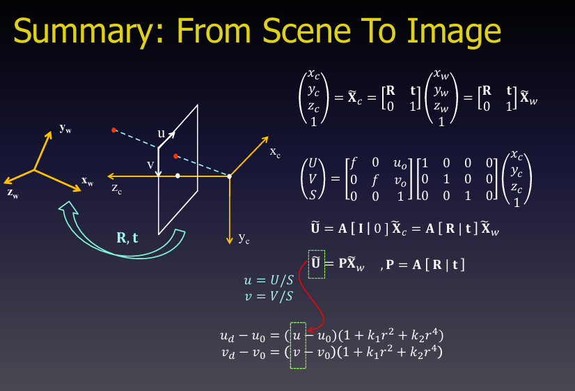

---

## 2. Color Transform
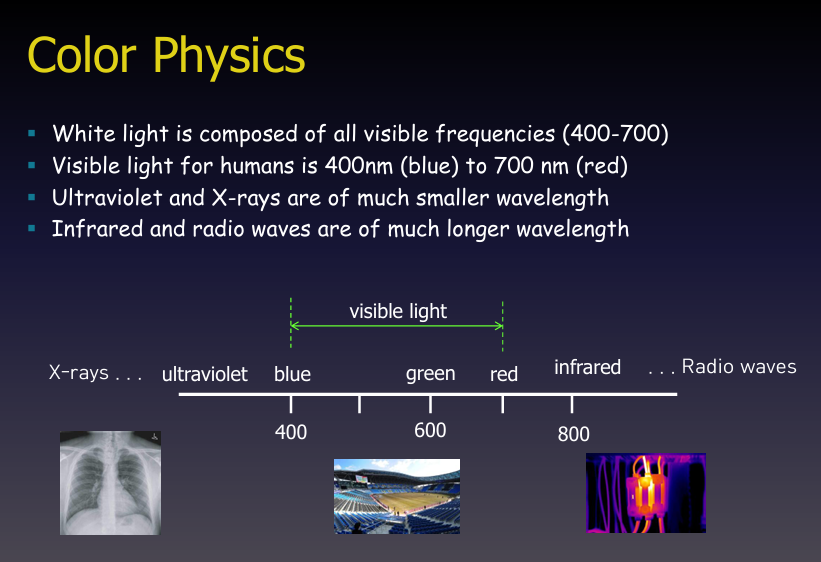

이미지는 컴퓨터 비전 및 그래픽스에서 다루는 색상 변환(Color Transform)의 기초가 되는 색채 물리학(Color Physics)과 전자기파 스펙트럼을 설명하고 있습니다.

**핵심 내용 및 스펙트럼 구조**

* **백색광(White light)**: 모든 가시광선 주파수 영역(400~700nm)의 빛이 혼합되어 구성됩니다.
* **인간의 가시광선 영역**: 사람이 눈으로 인지할 수 있는 파장 대역은 약 400nm(파란색 계열)에서 700nm(빨간색 계열) 사이입니다.
* **단파장 영역 (자외선 및 X선)**: 가시광선보다 훨씬 짧은 파장을 가지며, 이미지 하단 좌측의 X선 사진처럼 인체 내부나 미세 구조를 촬영하는 데 활용됩니다.
* **장파장 영역 (적외선 및 전파)**: 가시광선보다 긴 파장을 가지며, 이미지 하단 우측의 적외선(열화상) 카메라처럼 열이나 통신 신호를 감지하는 데 쓰입니다.

**하단 다이어그램의 의미**

* 전자기파 스펙트럼 상에서 왼쪽으로 갈수록 파장이 짧아지고(X선, 자외선), 오른쪽으로 갈수록 파장이 길어집니다(적외선, 전파).
* 그중 **400nm에서 700nm 사이**의 좁은 구간만이 인간이 볼 수 있는 **가시광선(visible light)** 영역임을 직관적으로 보여줍니다.

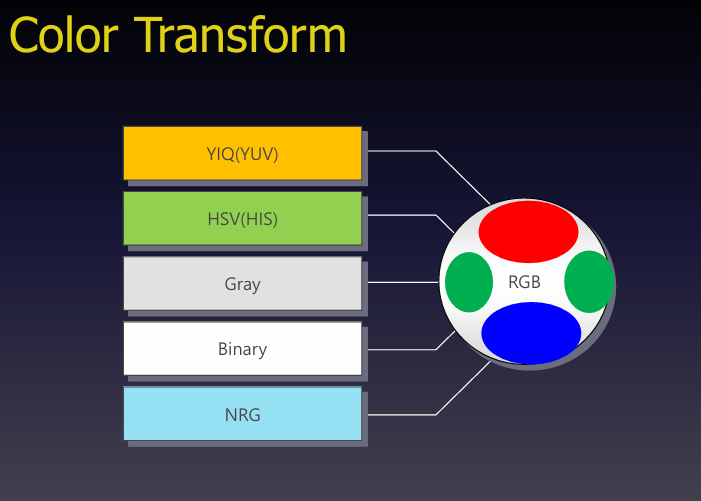

- 컴퓨터 비전과 영상 처리에서 기본이 되는 **RGB 컬러 모델**을 목적에 따라 다양한 색상 공간(Color Space)으로 변환하는 주요 방식을 보여주는 다이어그램입니다.

* **YIQ (YUV)**: 밝기 정보인 휘도($Y$)와 색상 정보인 색차($I/Q$ 또는 $U/V$)를 분리하는 모델입니다. 인간의 눈이 색상 세밀함보다 밝기 변화에 민감한 특성을 이용해 "텔레비전 방송 및 비디오 압축"에 널리 쓰입니다.
* **HSV (HIS)**: 색상(Hue), 채도(Saturation), 명도(Value/Intensity)를 기반으로 색을 정의합니다. 기계적인 RGB와 달리 사람이 색상을 직관적으로 인지하는 방식을 모사하여 색상 기반 객체 검출이나 필터링에 유용합니다.
- HSV는 컴퓨터 비전, 그래픽 소프트웨어의 컬러 픽커(UI디자인)에서 쓰인다.
* **Gray**: 컬러 이미지를 밝기 정보(Intensity)만 가지는 단일 채널의 흑백 이미지로 변환합니다. 연산량을 대폭 줄이고 윤곽선 검출 등의 전처리 단계에서 주로 사용됩니다.
* **Binary**: 특정 임계값(Threshold)을 기준으로 픽셀을 검은색(0) 또는 흰색(1) 두 가지 값으로만 단순화하여 이진화합니다. 객체 분할(Segmentation)이나 형태학적 분석의 기초가 됩니다.
* **NRG**: 조명 변화나 그림자의 영향을 최소화하기 위해 각 채널 값을 전체 RGB 값의 합으로 나누어 정규화한 **Normalized RGB** 모델입니다. 조명 변화에 강건한 색상 특징을 추출하는 데 활용됩니다.
* 
* **휘도 (Luminance, $Y$):** 이미지나 빛의 밝기 정보를 나타냅니다. 인간의 눈은 색상 변화보다 밝기 변화에 훨씬 민감하기 때문에, 영상 압축이나 흑백 정보 처리에서 핵심적인 역할을 합니다.
  - 인간의 눈이 느끼는 실제 밝기 민감도를 반영한 가중치 합 수식입니다. 예를 들어 $Y = 0.299R + 0.587G + 0.114B$ 형태로 계산됩니다. 인간은 초록색을 가장 밝게 느끼기 때문에 초록($G$)에 가장 높은 가중치(0.587)를 부여해 밝기를 정밀하게 산출합니다.
* **색차 (Chrominance):** 밝기 정보인 휘도를 제외한 색상의 종류와 진하기 등 순수한 컬러 정보를 뜻합니다. YUV 등의 색상 공간에서 데이터 용량을 줄이기 위해 휘도와 분리되어 사용됩니다.
   - 전체 밝기인 휘도($Y$) 성분을 쏙 빼고 남은 순수한 색 정보입니다. 파란색 성분에서 휘도를 뺀 값($U = B - Y$)과 빨간색 성분에서 휘도를 뺀 값($V = R - Y$) 형태로 계산하여, 밝기는 무시하고 오직 색의 종류와 진하기만 좌표로 다룹니다.
   - 휘도($Y$) 안에 이미 초록색($G$) 성분이 가장 큰 비중(약 58.7%)으로 포함되어 있기 때문에 굳이 $G - Y$를 따로 만들지 않습니다.
* **색상 (Hue):** 빨간색, 초록색, 파란색 등 색상 고유의 성질과 종류를 의미합니다. HSV 색상 공간에서 원통 좌표계의 각도($0 \sim 360^\circ$)로 표현됩니다.
  - 원통 좌표계에서의 각도($0^\circ \sim 360^\circ$)입니다. 빨강을 $0^\circ$(또는 $360^\circ$), 초록을 $120^\circ$, 파랑을 $240^\circ$로 두는 원형 컬러 휠을 상정하고, 입력된 RGB 값의 비율을 계산해 "이 색은 원의 몇 도 방향에 위치하는가?"를 삼각함수나 조건문 비율식으로 환산합니다.
* **채도 (Saturation):** 색의 순도나 선명함을 나타냅니다. 값이 높을수록(1에 가까울수록) 맑고 진한 원색을 띠며, 낮을수록(0에 가까울수록) 색기가 빠진 회색빛(무채색)이 됩니다.
  - RGB 공간에서 특정 색상의 점과, '그 색과 밝기가 같은 회색($R=G=B$)' 점 사이에 직선을 그었을 때 회색으로부터 얼마나 멀리 떨어져 있는가를 비율($0 \sim 1$)로 계산한 것입니다. 수식으로는 $S = \frac{\max(R,G,B) - \min(R,G,B)}{\max(R,G,B)}$로 표현됩니다.

* **명도 (Value / Intensity):** 색의 밝고 어두운 정도를 뜻합니다. HSV 모델에서 수직 축의 높낮이로 표현되며, 값이 낮을수록 어두워지고 높을수록 밝아집니다.
  - RGB 3차원 공간에서 검은색(원점)을 기준으로 빛이 얼마나 들어차 있는지를 나타냅니다. 가장 간단하게는 RGB 채널 중 가장 큰 값을 그대로 가져다 씁니다 ($V = \max(R,G,B)$). 값이 커질수록 숫자가 올라가며 밝아집니다.

### 1). NRG
- 평균화 내용. 그래서 light source에 민감하지 않다.
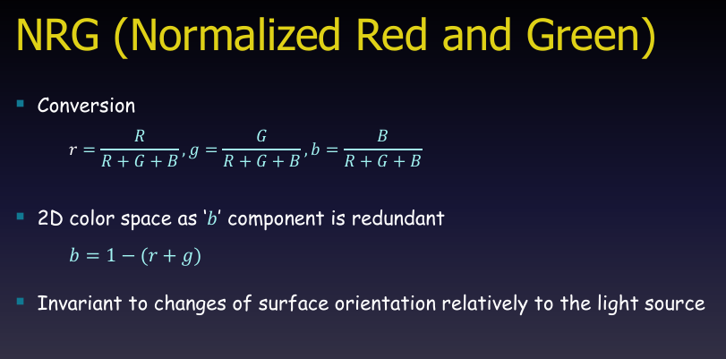
### 2). HSV(HSI, HSL)
- 같은 계통이다.
- 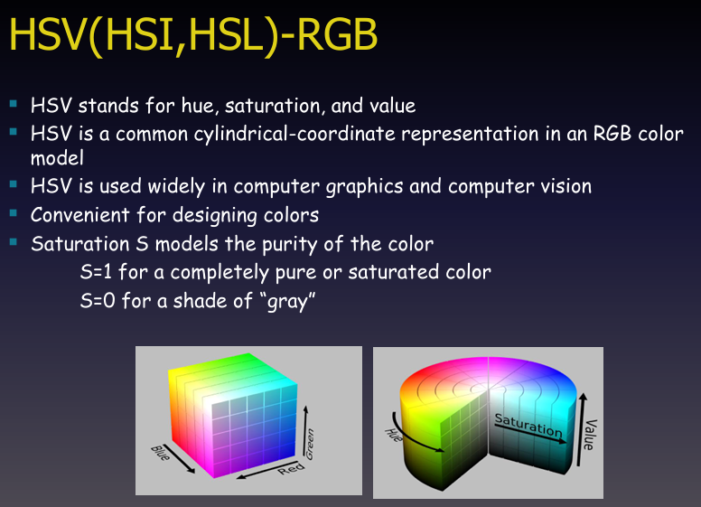
- 이미지는 직관적인 색상 제어와 분석을 위해 기존의 RGB 모델을 원통 좌표계로 변환한 **HSV(Hue, Saturation, Value) 모델**의 개념과 특징을 설명하고 있습니다.

**핵심 특징 및 정의**

* **용어 풀이**: 색상(Hue), 채도(Saturation), 명도(Value)의 약자로, 컴퓨터 그래픽스와 컴퓨터 비전 분야에서 널리 활용됩니다.
* **색상 디자인의 편리성**: 기계 중심의 수치인 RGB와 달리 사람이 색을 인지하는 방식과 유사하여 색상을 선택하고 조합하기 매우 직관적입니다.
* **채도(Saturation)의 역할**: 색의 순도(선명함)를 모델링하며, $S=1$일 때는 완전히 순수하고 진한 색이 되고, $S=0$일 때는 색기가 빠진 회색조(gray)가 됩니다.

**좌측과 우측 다이어그램의 차이**

* **좌측 (RGB 큐브)**: 빨강, 초록, 파랑 축을 직교 좌표계(Cube)로 표현한 방식으로, 컴퓨터(하드웨어)가 색상을 처리하기에 적합합니다.
* **우측 (HSV 실린더)**: RGB 큐브를 원통 좌표계로 변환하여, 회전 각도로 색상(Hue)을, 중심에서 바깥쪽으로의 거리를 채도(Saturation)를, 수직 높이를 명도(Value)를 나타내도록 구조화한 모델입니다.

### 3). HSV-RGB 변환식

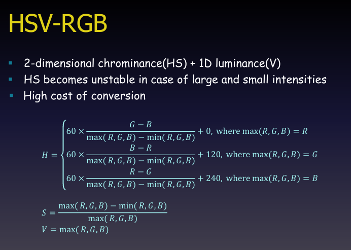
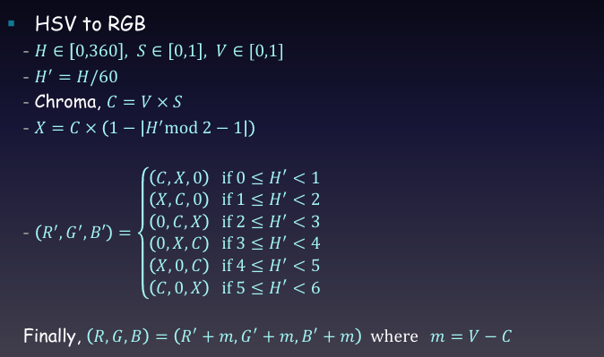

컴퓨터 그래픽스와 비전에서 **RGB와 HSV 색상 공간 간의 상호 변환 수식 및 주요 특징**을 설명하는 슬라이드입니다.

**특징**

* **구조**: 2차원의 색상·채도(HS)와 1차원의 명도(V) 공간으로 이루어져 있습니다.
* **불안정성**: 명도가 너무 낮거나(어두움) 높을 때(밝음) 색상(H)과 채도(S) 값이 쉽게 불안정해집니다.
* **연산 비용**: 변환 과정에서 최댓값/최솟값 비교, 나눗셈, 조건문 등이 포함되어 변환 비용이 큽니다.

**RGB에서 HSV로의 변환 (RGB to HSV)**

* **명도($V$)**: RGB 채널 중 가장 큰 값으로 결정됩니다 ($V = \max(R, G, B)$).
* **채도($S$)**: 최댓값과 최솟값의 차이를 최댓값으로 나눈 비율로 계산됩니다 ($S = \frac{\max - \min}{\max}$).
* **색상($H$)**: 어떤 채널이 최댓값인지에 따라 0도, 120도, 240도를 기준으로 각도를 계산하여 0에서 360 사이의 값으로 매핑합니다.

**HSV에서 RGB로의 변환 (HSV to RGB)**

* 입력 값의 범위는 $H \in [0, 360]$, $S \in [0, 1]$, $V \in [0, 1]$입니다.
* $H' = H / 60$과 크로마($C = V \times S$), 중간 변수 $X$를 먼저 계산합니다.
* $H'$의 값 이 범위(0~6)에 속하는지에 따라 $(R', G', B')$의 기본 채널 배치가 달라집니다.
* 최종적으로 $m = V - C$ 값을 각 채널에 더해주어 원래의 RGB 값을 복원합니다.
### 4). Sepia Tone Transfrom
- 여기에서 숙제가 나간다.
- Sepia 색감으로 바꾸는 것.

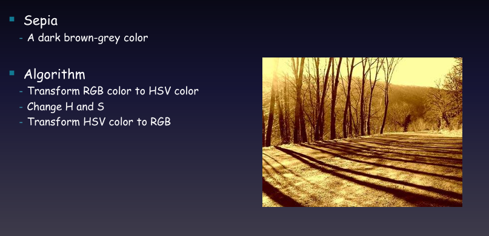
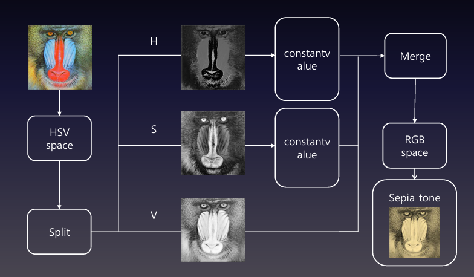

이후 실습을 진행하였다.
