## 1. Color Transform
- Contrast에 대해 다룬다.
### 1). Contrast 개념
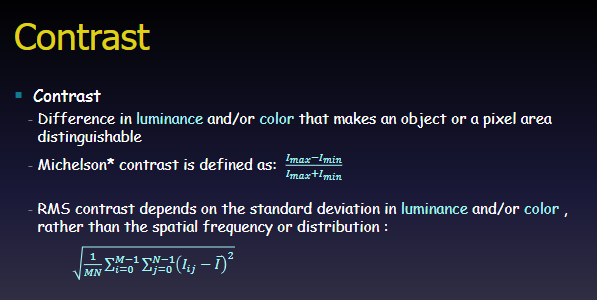

- 대비(Contrast) : 물체나 픽셀 영역을 서로 구분할 수 있게 만들어 주는 휘도(밝기) 및 색상의 차이
- 마이켈슨 대비(Michelson Contrast) : 가장 밝은 부분과 어두운 부분의 휘도 차이를 기준으로 정밀하게 계산하는 방식
- $$\frac{I_{max} - I_{min}}{I_{max} + I_{min}}$$
- **RMS 대비 (Root Mean Square Contrast)**: 공간 주파수나 배치 형태와 관계없이, 전체 픽셀 밝기의 **표준편차**를 기반으로 계산하는 방식입니다.

$$\sqrt{\frac{1}{MN} \sum_{i=0}^{M-1} \sum_{j=0}^{N-1} (I_{ij} - \bar{I})^2}$$

- $M, N$: 이미지의 가로·세로 픽셀 크기
- $I_{ij}$: $(i, j)$ 위치의 픽셀 밝기 값
- $\bar{I}$: 이미지 전체 픽셀의 평균 밝기 값

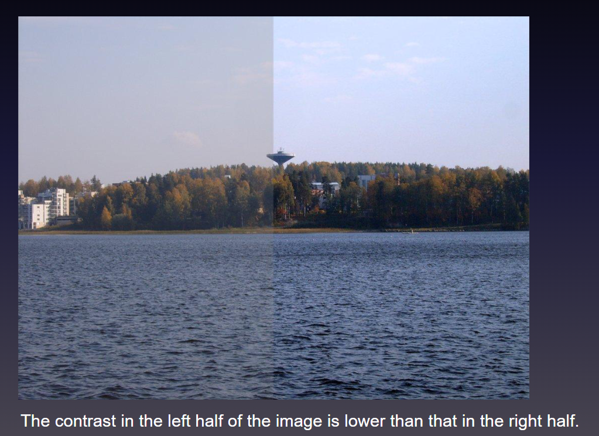


### 2). Image Historgram
- 강도- 픽셀수
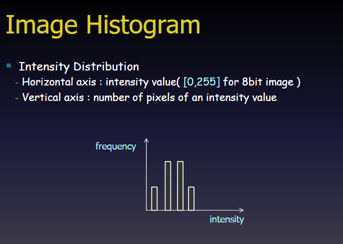
- **이미지 히스토그램의 정의**: 이미지 내부 픽셀들의 **밝기(Intensity) 분포**를 그래프로 표현한 것입니다.
    
- **가로축 (Horizontal axis)**: 픽셀의 밝기 값(Intensity value)을 나타냅니다. 일반적인 8비트 이미지 기준 범위는 **0~255** (0: 검은색, 255: 흰색)입니다.
    
- **세로축 (Vertical axis)**: 해당 밝기 값을 가진 픽셀의 개수(빈도수, frequency)를 나타냅니다.


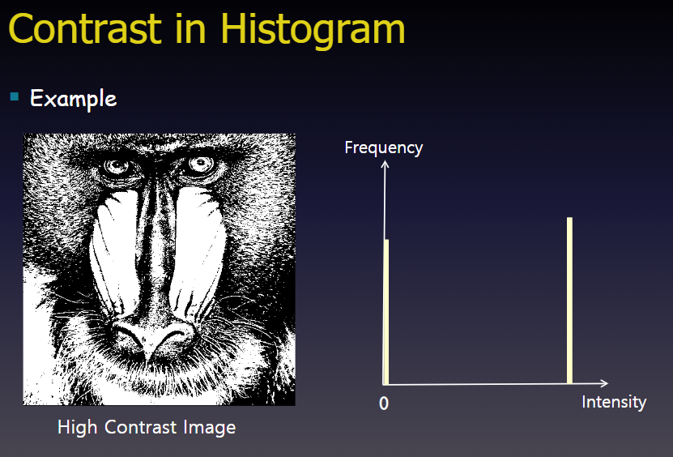
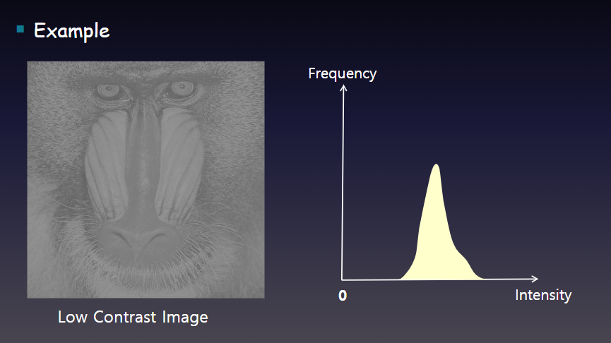

``` C++
// <구현 코드>

int nRow = igImg.Row(); //igImg : KImageGray Object 
int nCol = igImg.Col(); //init. 
vector<int> vHisto(256); 
for(int i=0; i<nRow; i++) 
	for(int j=0; j<nCol; j++) 
		vHisto[ igImg[i][ j] ] ++;


```


### 3). Contrast Transform (대비 변환)
- 아래 그래프는 변환식 정도로 보면 될 것.
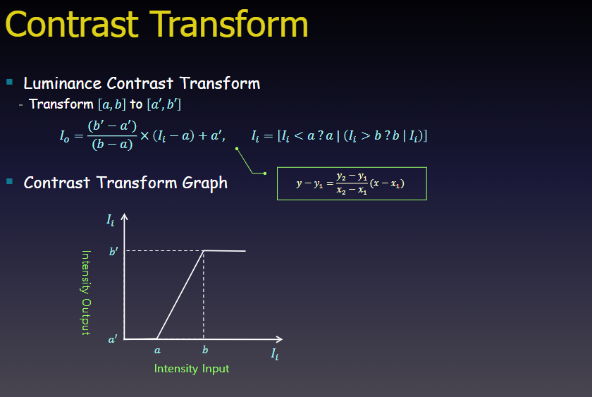
- **휘도 대비 변환(Luminance Contrast Transform)**: 기존 이미지의 밝기 범위를 $[a, b]$에서 원하는 범위 $[a', b']$로 늘리거나 줄여 대비를 조절합니다.
    
- **선형 방정식 원리**: 기본적인 1차 직선 방정식 $y - y_1 = \frac{y_2 - y_1}{x_2 - x_1}(x - x_1)$을 응용한 변환입니다.
    
    $$I_o = \frac{(b' - a')}{(b - a)} \times (I_i - a) + a'$$
    
    - $I_i$: 입력 픽셀 밝기값, $I_o$: 출력 픽셀 밝기값
        
    - 입력 범위 $[a, b]$를 출력 범위 $[a', b']$로 선형 매핑합니다.
        
- **예외 처리 (Clamping)**: 범위 $[a, b]$를 벗어나는 값에 대한 예외 처리 식입니다.
    
    $$I_i = [I_i < a \ ? \ a \ \vert{} \ (I_i > b \ ? \ b \ \vert{} \ I_i)]$$
    
    - $a$보다 작은 값은 모두 $a$로, $b$보다 큰 값은 모두 $b$로 고정(Clipping)합니다.
        
- **변환 그래프 분석**:
    
    - $a$ 미만의 입력값은 모두 $a'$로 변환됩니다.
        
    - $b$ 초과의 입력값은 모두 $b'$로 변환됩니다.
        
    - $a$와 $b$ 사이의 값은 경사가 급한 직선을 따라 크게 확대되어 **대비(Contrast)가 증가**합니다.


- RGB 모든 Band에서 Contrast를 수행한다.
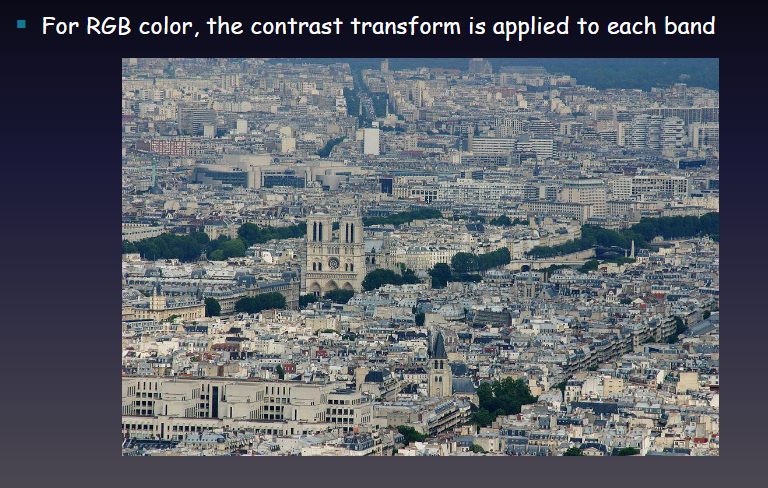
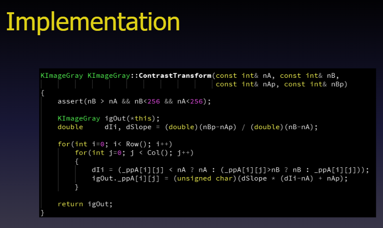

## 2. Image Thresholding (이미지 문턱값 처리,임계값 처리)

### 1). Image Thresholding 이란?
- **이미지 분할의 최단 경로**: 이미지를 두 개의 영역(예: 배경과 객체)으로 나누는 가장 간단한 분할(Segmentation) 방법입니다.
    
- **이진화(Binarization)**: 회색조(Gray-scale) 이미지를 오직 검은색과 흰색 두 가지 색상만 존재하는 이진 이미지(Black-white image)로 변환합니다.
    
- **작동 원리**: 임계값(Threshold, $T$)을 기준으로 픽셀 밝기가 $T$보다 크면 흰색(1 또는 255), $T$ 이하이면 검은색(0)으로 지정합니다.
    
    $$g(x,y) = \begin{cases} 255 & \text{if } f(x,y) > T \\ 0 & \text{if } f(x,y) \le T \end{cases}$$
    
- **예시 예제**: 왼쪽의 쌀알 회색조 이미지에서 배경(어두운 영역)과 쌀알(밝은 영역)을 분리하여 오른쪽처럼 명확한 이진 이미지로 추출해 낸 모습을 보여줍니다.
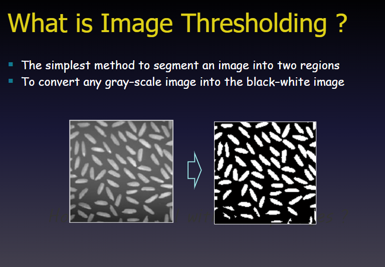

### 2). 기본 전제
- 아래 전제를 만족해야할 때, Object랑 배경이 구분이 될 것이다.
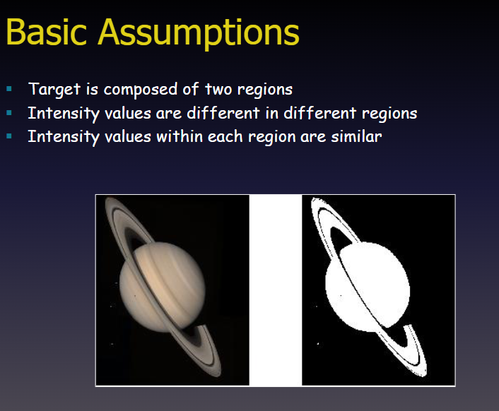

### 3). 이진 이미지 변환
- g는 Gray 이미지, b는 Binary 이미지
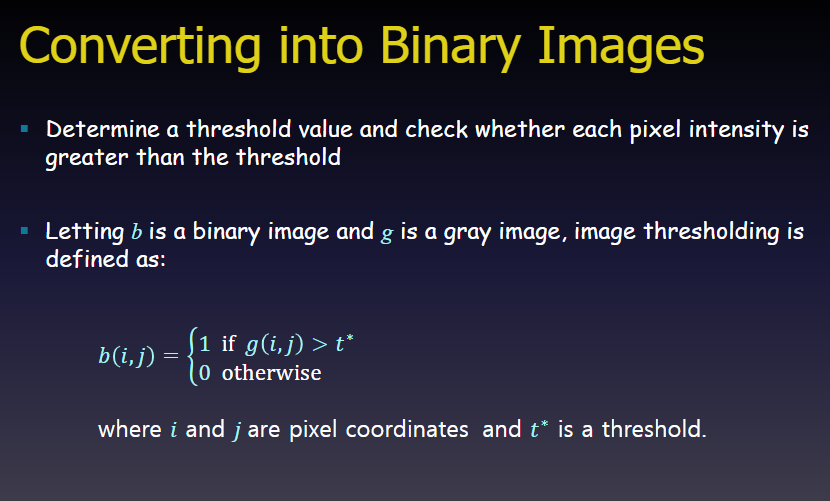
**핵심 가정 3가지**

- **두 개의 영역으로 구성**: 대상 이미지는 크게 두 개의 영역(예: 배경과 관심 객체)으로 나뉩니다.
    
- **영역 간 밝기 차이**: 서로 다른 영역끼리는 밝기(Intensity) 값의 차이가 명확합니다.
    
- **영역 내 밝기 유사성**: 같은 영역 내부의 픽셀들은 서로 유사한 밝기 값을 가집니다.
    

**예시 영상 (토성 이미지)**

- **왼쪽**: 원본 토성 이미지 (배경은 어둡고, 토성과 고리는 상대적으로 밝음)
    
- **오른쪽**: 임계값 처리를 통해 어두운 배경(검은색)과 밝은 토성 물체(흰색)로 영역이 성공적으로 분할된 이진화 결과입니다.

### 4). 히스토그램 분석
- 색깔의 Intesity 측면에서 보는 것이다.
- LPF, HPF 느낌으로 적절한 Threshold를 정해서 나누면 구분 가능하다.
- 오추 알고리즘? 이런게 있다고 하네( 계곡점을 찾는 알고리즘 느낌이라 보면 된다.)


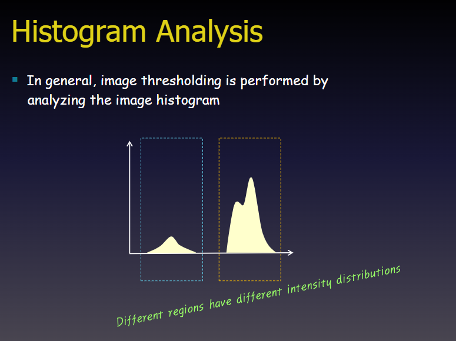

- 좁은 영역의 높은 피크값.
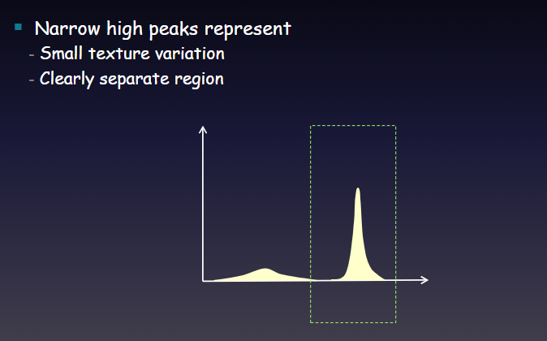


- 이런 유형에서는 Threshold를 믿을 수 없다.
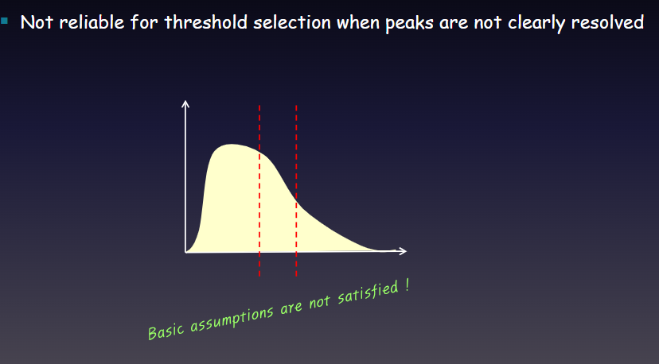


- Threshold는 peak사이의 골이 가장 적절하다.
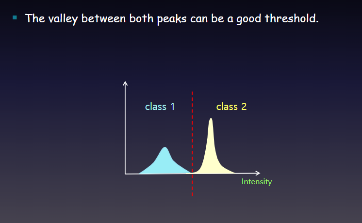
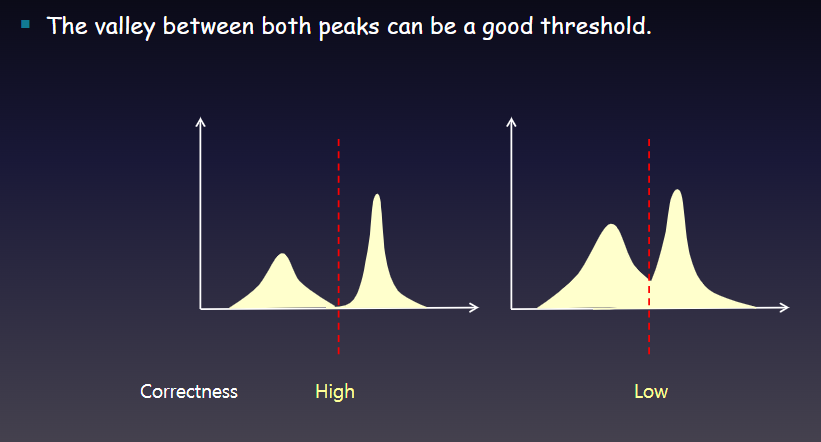


### 5). Optimal Thresholding
- 최적화 하는 방법론이다.
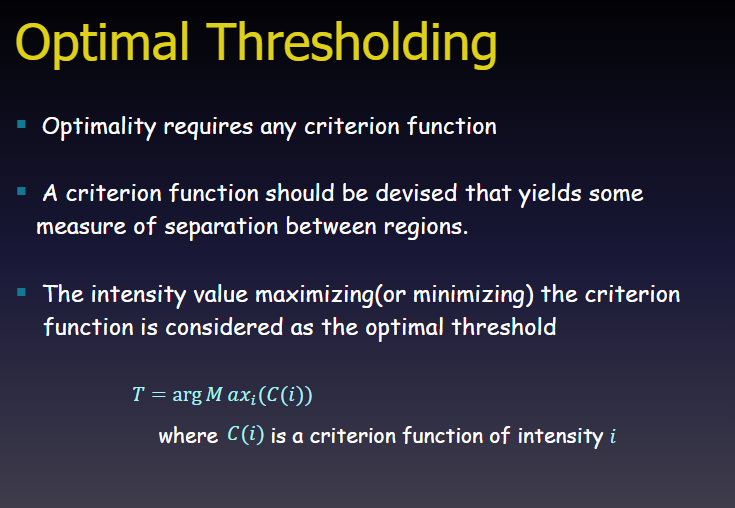
**핵심 개념 요약**

- **판단 기준 함수(Criterion Function)의 필요성**: 임계값이 '최적(Optimal)'인지 평가하려면 영역 분리 정도를 측정할 목적 함수 $C(i)$가 필요합니다.
    
- **영역 분리 측정**: 기준 함수는 배경과 객체 영역이 얼마나 잘 분리되었는지를 나타내는 척도 역할을 합니다.
    
- **최적 임계값($T$) 결정**: 기준 함수 $C(i)$를 최대화(또는 최소화)하는 밝기값 $i$를 최적 임계값으로 산출합니다.
    
    $$T = \arg\max_{i} (C(i))$$
    
    _(여기서 $C(i)$는 밝기 값 $i$에 대한 기준 함수를 의미합니다.)_
- 대표적인 목적함수 Otsu's Method
