## 0. 카메라의 역사

  
- **카메라 옵스큐라 (Camera Obscura):** 어두운 방이나 상자에 작은 구멍을 뚫어 외부 풍경이 반대로 맺히도록 하는 최초의 카메라 원리입니다.

  

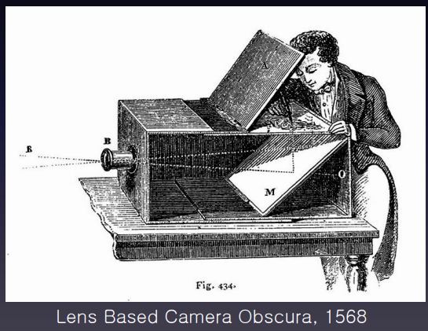

  
---

  
## 1. 핀홀 카메라

  
### 0). 개념

  

- **핀홀 카메라 (Pinhole Camera):** 구멍(Aperture)을 작게 만들어 초점을 맞추는 방식입니다.

  

    - **장점:** 구멍이 작아질수록 이미지가 선명해지지만, 빛의 양이 줄어들어 어두워진다. (Blurring 줄어든다.)

  

    - **한계** : 회절(Diffraction) 현상으로 인해 다시 번지는 한계가 있습니다.

  

    - 회절 : 파동(빛)이 장애물이나 작은 구멍(핀홀)을 지날 때 직선으로 진행하지 않고 구멍 뒤편까지 넓게 퍼져 나가는 현상을 의미합니다.

  

  

### 1). 핀홀의 문제점

- 핀홀 구멍 크기를 좁게 만들면

- 1.초점이 더 잘 맞는다.

- 2.화면에 도달하는 빛의 양이 줄어든다.

- 3.회절 현상 때문에 오히려 상이 흐려진다.

- (빛은 파동이라서 좁은 구멍을 통과할 때 넓게 퍼지는 회절 현상이 일어난다.)

- (구멍을 너무 줄이면 이 파동 퍼짐 때문에 오히려 이미지 전체가 뭉개지고 흐려진다.)

  

### 2).  회절각 공식

  

  $$\theta = \frac{\lambda}{d}$$

  

- **기호 의미**

    - $\theta$: 빛이 구멍을 통과하며 퍼지는 각도(회절각, 라디안 단위)

    - $\lambda$: 통과하는 빛의 파장 (Wavelength)

    - $d$: 핀홀(구멍)의 지름 (Pinhole diameter)

- **원리 설명**

    - 구멍 크기 $d$가 작아질수록 회절각 $\theta$가 커집니다.

    - 즉, 선명한 이미지를 얻기 위해 핀홀을 너무 좁게 만들면 빛이 오히려 넓게 퍼지면서 상이 흐려지는 현상(Diffraction blurring)이 발생합니다.

### 3). 최적의 핀홀 지름 공식

  

$$d = 2\sqrt{f'\lambda}$$

  

- **기호 의미**

    - $d$: 최적의 상을 얻기 위한 핀홀 지름

    - $f'$: 핀홀에서 초점 면(이미지 센서/필름)까지의 거리 (초점 거리)

    - $\lambda$: 빛의 파장

- **원리 설명**

    - **기하광학적 트레이드오프(Trade-off)**: 구멍($d$)을 크게 하면 기하학적으로 빛이 넓게 들어가 상이 흐려지고, 구멍을 작게 하면 회절 현상 때문에 상이 흐려집니다.

    - **최적 조건**: 기하학적 흐림과 회절에 의한 흐림이 최소화되는 균형점을 계산한 결과로, 상의 초점이 가장 선명해지는 최적의 구멍 지름 $d$를 구해줍니다.


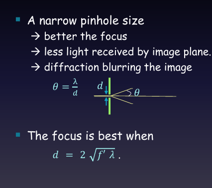
  
  
  

---

  

## 2. 렌즈의 사용과 한계

### 0). 렌즈 공식

- **가우스 얇은 렌즈 공식 (Gaussian Thin Lens Formula)**

  

$$\frac{1}{i} + \frac{1}{o} = \frac{1}{f}$$

  

- **기호의 의미**

    - $o$ (object distance): 렌즈 중심에서 **물체($P$)까지의 거리**

    - $i$ (image distance): 렌즈 중심에서 **상이 맺히는 면($P'$)까지의 거리**

    - $f$ (focal length): 렌즈의 **초점 거리** (렌즈가 빛을 얼마나 강하게 꺾는지를 나타내는 고유 특성)

  
  


  
  
  

**이 공식이 뜻하는 것**

  

물체와의 거리($o$)와 렌즈의 초점거리($f$)가 결정되면, 선명한 상이 맺히는 위치($i$)는 **단 하나로 딱 정해진다**는 뜻입니다. 센서나 필름이 정확히 $i$ 위치에 있어야 초점이 또렷하게 맞고, 이 위치에서 벗어나면 아웃포커싱(흐림)이 발생합니다.

  
  

### 1). 렌즈 사용시 한계

핀홀의 빛 부족 문제를 해결하기 위해 렌즈를 사용하여 모으는 빛의 양을 늘리고 Sharp한 초점을 구현합니다. 핀홀은 같은 투사를 하지만 더 많은 빛을 모은다.

하지만 렌즈 사용 시 다음과 같은 광학적 문제가 발생합니다:  

  

- **구면 수차 (Spherical Aberration):** 렌즈의 구면 형태로 인해 빛이 한 점에 모이지 않는 현상 (비구면 렌즈(Non-Spherical Lens)나 다중 렌즈(Multiple Lens)로 보정).

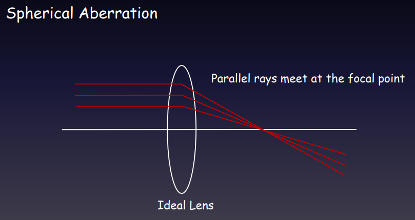

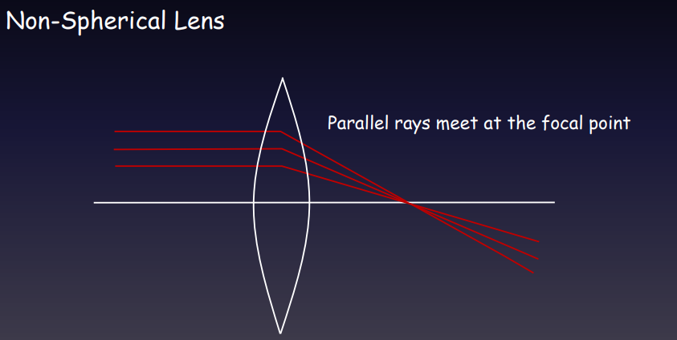

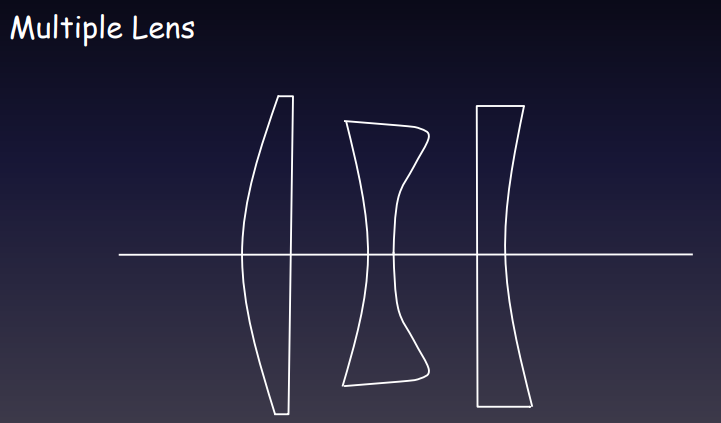

  
  
  
  

- **색수차 (Chromatic Aberration):** 빛의 파장(색상)에 따라 굴절률이 달라 색상이 번지는 현상.

  
  

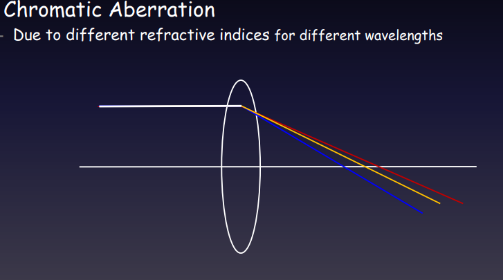

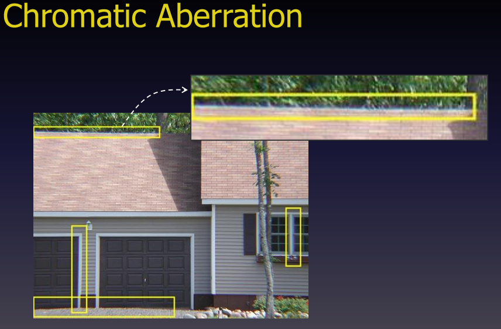

  
  
  

- **비네팅 (Vignetting):** 다중 렌즈 가림 등으로 인해 외곽부 빛이 차단되어 이미지 주변부가 어두워지는 현상.

  

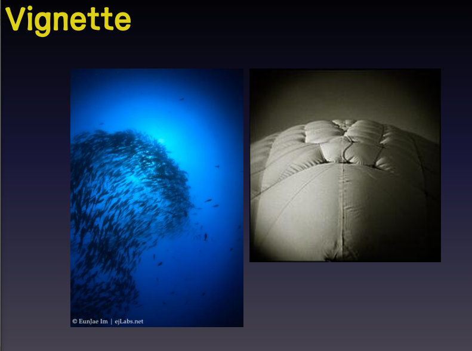

  
  

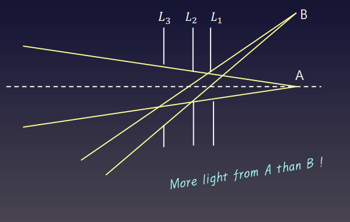

  
  

- **렌즈 왜곡 (Lens Distortion):**

  

    - **방사 왜곡 (Radial Distortion):** 광학 축에서의 거리에 따라 배율이 변함 (배 모양의 **Barrel distortion**, 핀쿠션 모양의 **Pincushion distortion**).

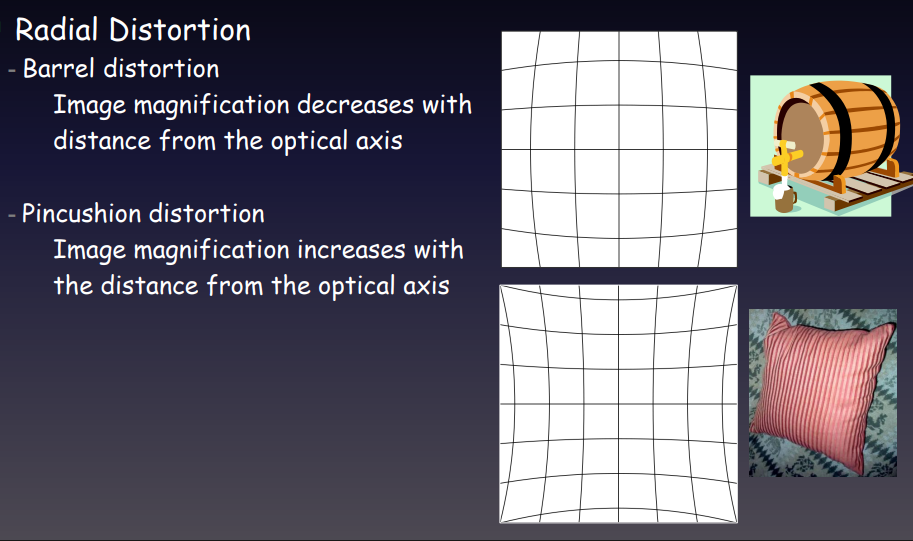

- **접선 왜곡 (Tangential Distortion):** 렌즈와 센서의 평행이 맞지 않아 발생.

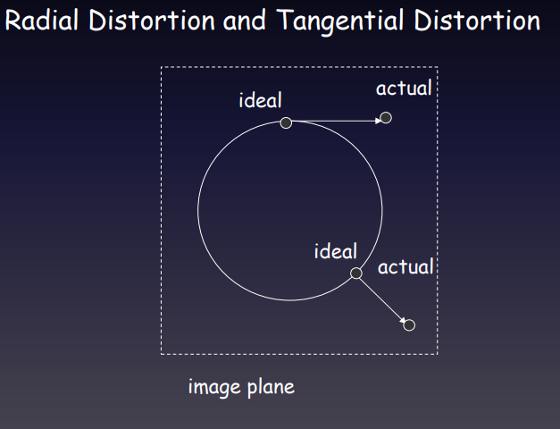

  

### 2). 왜곡의 원인

- 렌즈 중심부와 외각부의 배율 차이 때문이다.

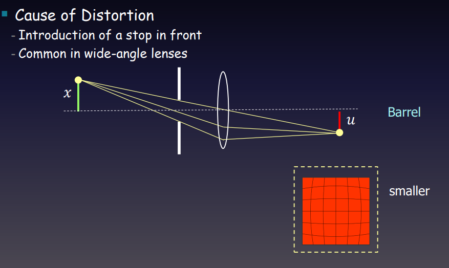

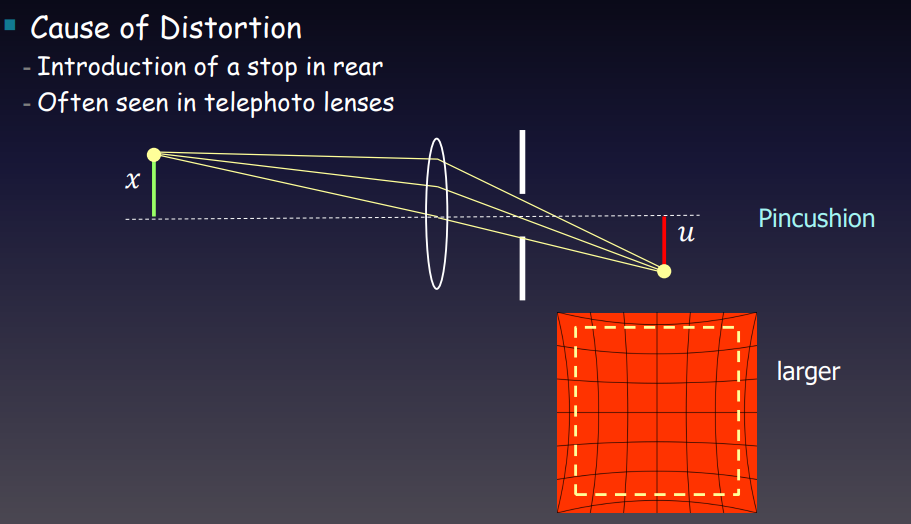

  
  
---
## 3. Perspective Projection (원근 투영 모델)

3차원 공간상의 점 $(x, y, z)$이 2차원 이미지 평면 $(u, v)$에 투영되는 수학적 모델을 다룹니다.

### 1). 핀홀 카메라 모델 
   
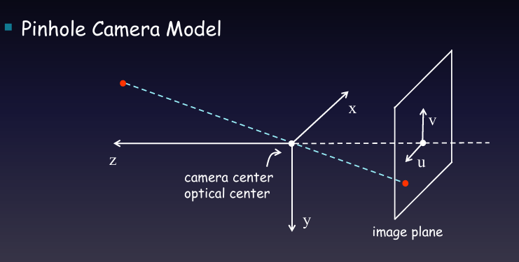
  - 렌즈 중심을 xyz 좌표계의 중심으로 잡는다.
  - 카메라 앞쪽을 Z 방향으로 잡는다.
  - 카메라 오른쪽을 x 방향 (오른쪽은 보통 +니까)
  - 카메라 아래는 y 방향 (왼손 법칙 마냥 외워)
  - 저 이미지 상은 inverted 되어있기 때문에 X,Y와 반대로 u,v가 설정되는 것이다. 

### 2). 핀홀 카메라 모델2
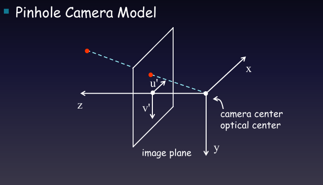
- 이거는 수학적으로 이미지 상이 먼저 맺히고 렌즈를 통과한다고 보는 방식이다.
- 원래는 렌즈 뒤에 있는데 이를 Inverted해서 보기 편하게 만든 방식이라고 보면 된다.
- 이를 이용하여 아래 식을 이용해서 관계식을 구할 수 있다.


### 3). u', v' 관계식 구하기
- 핀홀 카메라 모델2에서의 u', v'을 구하는 것이다.

![[uv좌표계.png]]

- **핀홀 카메라 모델 수학 공식:**
  

    $$u' = \frac{fx}{z}, \quad v' = \frac{fy}{z}$$

    (여기서 $f$는 렌즈의 초점거리 Focal Length)

  
### 4). u', v' 관계식 행렬로 표현하기
- 모든 3차원 점들이 2차원의 이미지에 투영되는데, 여기서 스케일(거리)을 고려한 좌표계를 Homogeneous Coordinate 이라 한다.
- (X,Y,Z), (2X,2Y,2Z), (kX,kY,kZ) 같은 모든 점들이 2차원 이미지의 한점에 투영된다.
- 이를 반영하기 위해 한 차원 늘려서 Scale Factor(z값이다)를 넣어두었다.
- 3차원 공간을 (x,y,z,1) 표현하였고
- 2차원 공간을 (U',V',S') 으로 표현하였다.
- 이미지 좌표 u', v'을 구할려면 위 좌표에서 u' =  U'/S' , v' = V'/S' 이런 식으로 표현하면 된다.
- 이를 전개하면 행렬식으로 억지 변환할 수 있다.(이때 3차원 좌표를 넣으면 2차원 좌표가 산출되는 식이 생성된다.)
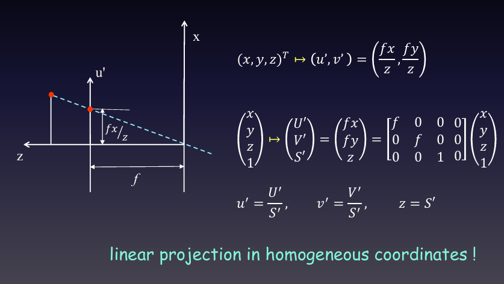

``` python
[Homogeneos Coordinates]
- 동차 좌표계 : 기존 좌표 표현에 차원을 1개 추가하여 선형 변환(행렬 곱셈)으로 처리할 수 있게 만드는 수학적 좌표 표현법 입니다.

- u', v'에는 z로 나누는 비선형 변환 요소가 있어서 단순한 행렬 곱셈 형태로 표현할 수가 없다.
- 이를 해결하기 위해 좌표 뒤에 스케일 요소 w를 하나 더 붙여 차원을 1차원 확장합니다.
  
- 행렬 곱셈 결과로 나오는 동차 좌표(U', V',S')은 (fx,fy,z)가 되고 
  실제 원하는 2차원 이미지 좌표를 얻으려면 마지막 스케일값으로 각 요소 나누기를 수행해야한다.
  
```
- 아래 식으로 다시 전개할 수 있다.

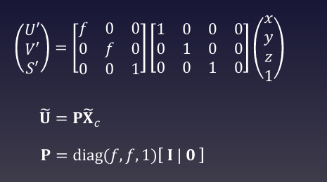
- P : Projection Matric
- X_c : 카메라 좌표계에서의 좌표라서 c를 붙인다.
- 위에 물결표인 틸트를 붙여서 표현한다.

### 5). 광축이란
- 광축(Optical Axis)은 렌즈나 거울 같은 대칭적인 광학계에서 모든 광학 요소의 중심을 곧게 관통하는 가상의 중심선(기준선)을 의미합니다.
- Z축이다.

---
## 4. Principal Point
- 이미지는 좌상위 좌표계로 표현하는데, 앞서 표현한 광축과 이미지 상이 만나는 점을 기준으로 u', v'을 구하였다.
- (이미지의 좌측 상단을 (0,0)으로 두고 표현한다.)
- 이를 좌상위 좌표계로 다시 표현하겠다.

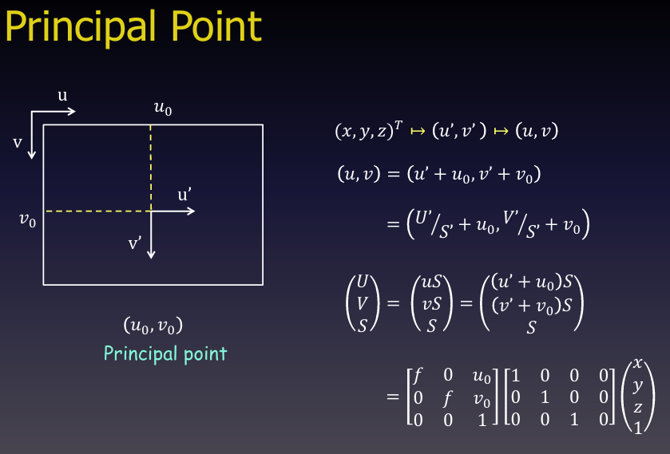

- (u0, v0)를 이미지 센터 혹은 Pricipal Point 라고 한다.

- K Metrics : 카메라 메트릭스라고 한다. 
- f, u0,v0은 카메라의 변수이므로 Intrinsic Parameter라고 한다.


---
## 5. Rotation and Translation
- 이제 World Coordinate에서 적용해보자.
- 일단 카메라와 World Coordiante가 같이 있다고 가정을 한다. 
- 아래는 월드 좌표를 카메라 좌표로 바꾸는 것이다.
- t_w : 카메라 좌표계에서 바라본 월드 좌표계의 원점 좌표
- R_w (Rotation Matrics)
	- 1번째 Column :  카메라 좌표계에서 바라본 월드 좌표계의 x_w 방향 벡터
	- 2번째 Column :  카메라 좌표계에서 바라본 월드 좌표계의 y_w 방향 벡터
	- 3번째 Column :  카메라 좌표계에서 바라본 월드 좌표계의 z_w 방향 벡터
- 이 관계성은 로봇공학 수업에서 나온 거라 말만하고 넘어간다.
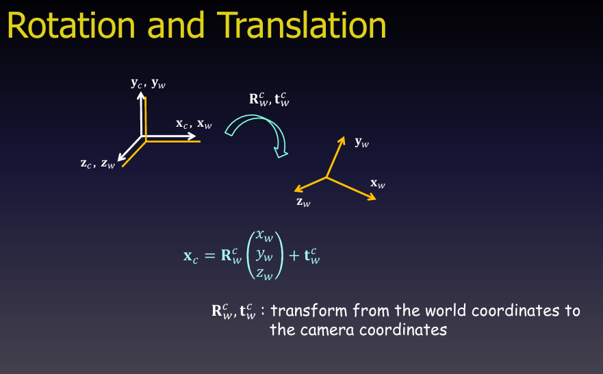
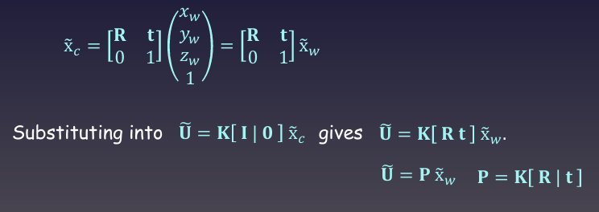

- [R t , 0 1] 부분은 4x4 이다.
- 이를 앞선 Principal Point가 적용된 homogeneous 좌표계에 대입하면 저런 값이 나온다.


---
## 6. Ideal Perspective Projection
- x_w는 m, mm를 쓰는데... x_c는 pixel을 단위로 쓴다. 
- 따라서 mm당 몇 pixel인지를 정보에 기록해야 한다. (Pixel per mm)
- 그래서 카메라 메트릭스 K에 ku, kv를 곱해준다.
- 알파, 베타는 픽셀 단위의 focal length이다. 
- 그리고 마지막 부분의 u0, v0는 픽셀 단위의 Principal Point이다.

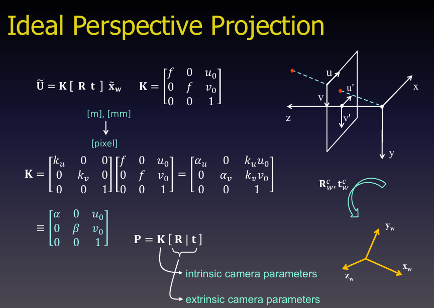

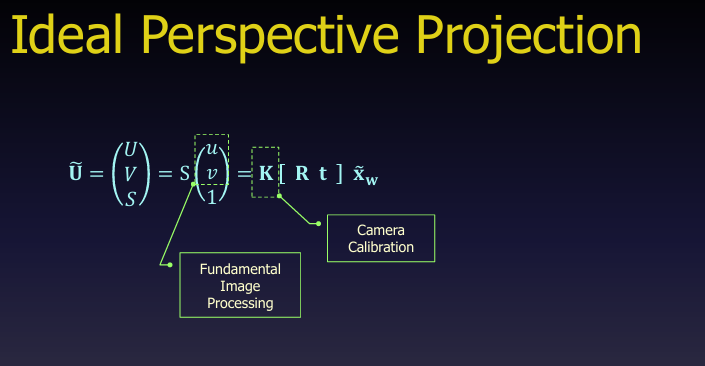

---
## 7. 로봇비전응용 수업에서 카메라 캘리브레이션 다룰 것이다.
